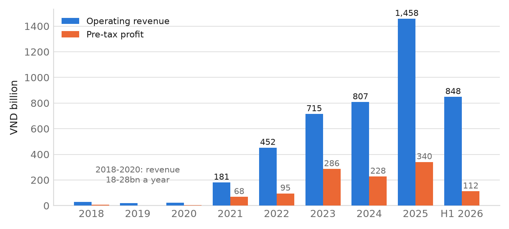
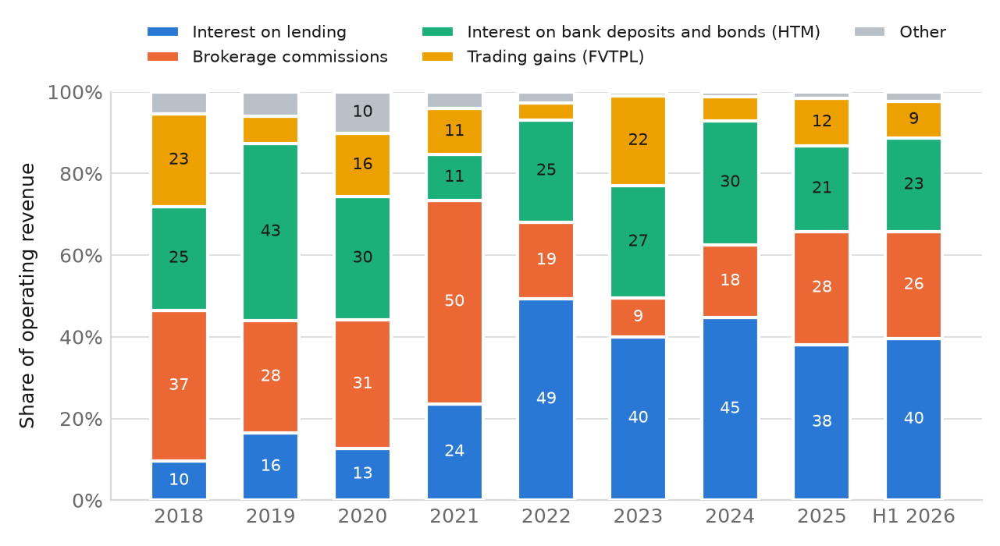
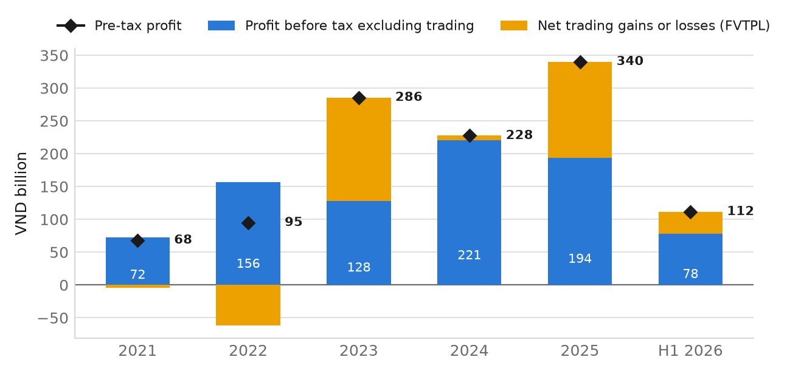
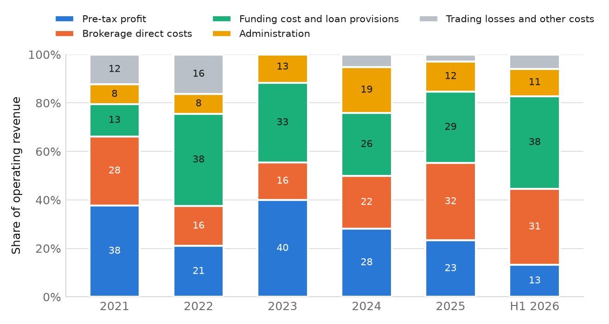
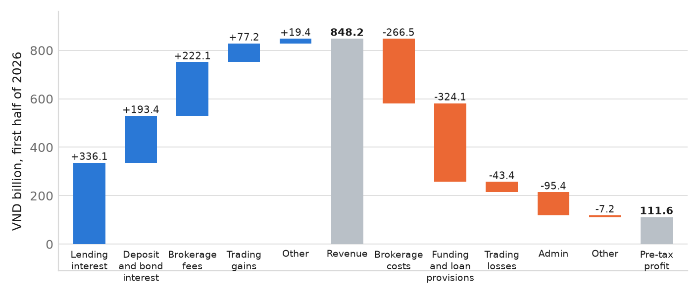
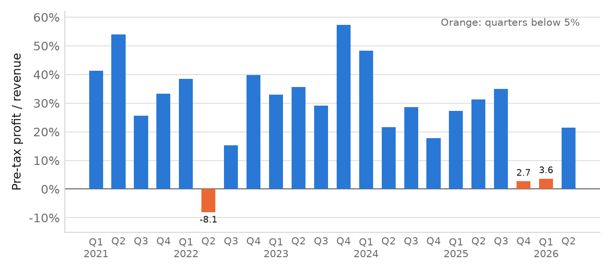
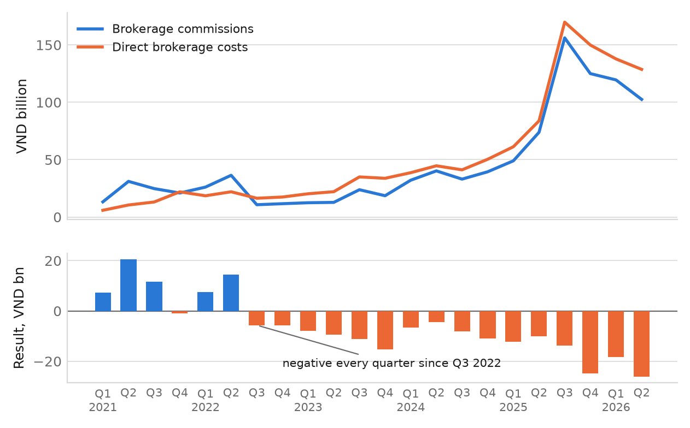
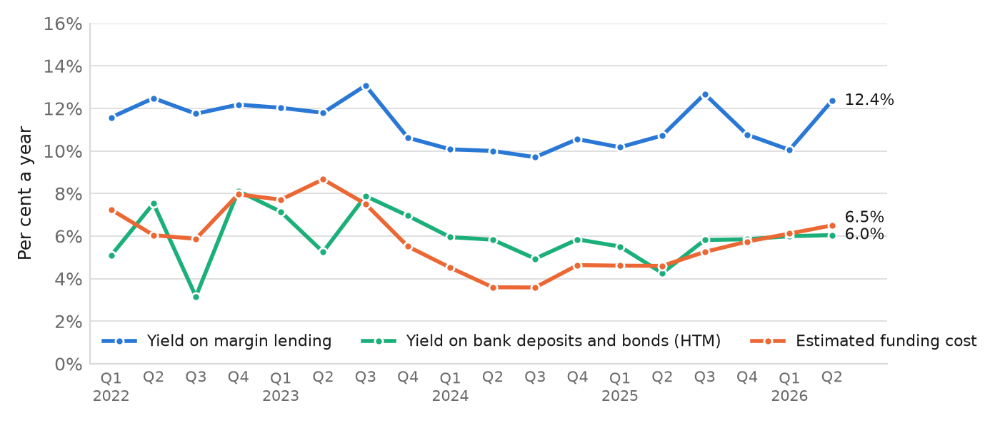
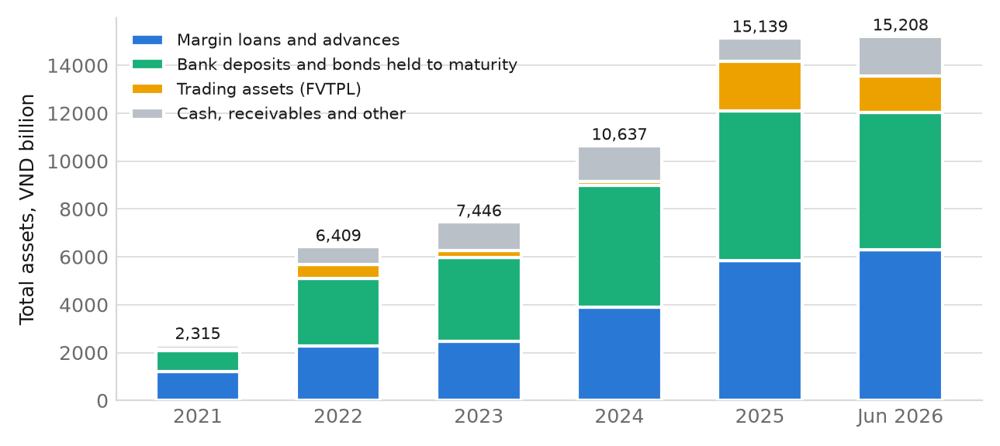
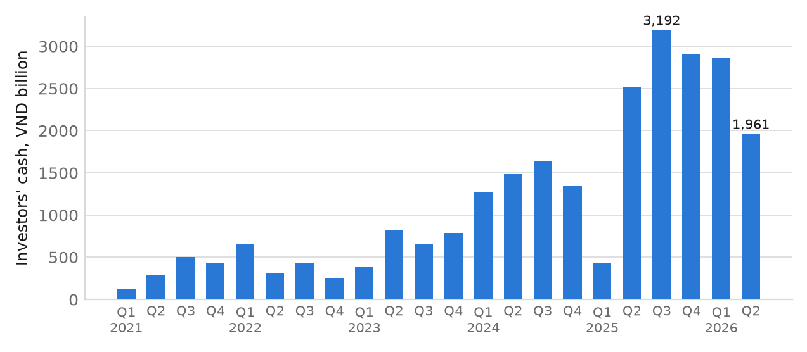

# DNSE qua báo cáo tài chính: đối chiếu báo chí và xu hướng 2018–2026

*Ghi chú làm việc cho team FBA Season 6 Round 2. Lập ngày 24/09/2026.*
*Ký hiệu 🔎 đánh dấu giả thuyết hoặc suy luận chưa kiểm chứng.*

**Nguồn:** BCTC của DNSE, lấy đủ mọi dòng (KQKD, bảng cân đối, lưu chuyển tiền tệ, thuyết minh) từ dịch vụ dữ liệu của Vietcap bằng `01b_dnse_financials_fetch.py`. Số 6 tháng đầu 2026 khớp đến từng đồng với BCTC bán niên do KPMG soát xét (14/8/2026). Biểu đồ vẽ bằng `05c_charts_bctc.py` và lưu trong `fig/bctc/`. Đơn vị: tỷ đồng, trừ khi ghi khác.

---

## Tóm tắt

1. **Báo chí chép số đúng ở phần lớn chỉ tiêu.** 27 trên 36 chỉ tiêu khớp trong phạm vi làm tròn. Chín chỗ lệch gồm:
   - Bốn chỉ tiêu lấy từ bản BCTC chưa soát xét, ví dụ LNTT Q2/2026 là 98,9 thay vì 97,4.
   - Doanh thu và tăng trưởng doanh thu FY2025.
   - Một con số không có dòng nào trong BCTC tái lập được: "dự phòng tự doanh +405%".
   - Nhầm LNTT với LNST ở tăng trưởng 9 tháng 2023, và vốn điều lệ lệch 3,5 tỷ.

   Ngoài ra, data pack tự gây một lỗi định nghĩa ở "investment income".
2. **Lợi nhuận lõi đi ngang từ 2022.** LNTT không tính lãi/lỗ tự doanh qua các năm là 156, 128, 221, 194 tỷ, và 78 tỷ trong H1/2026. Cùng giai đoạn, doanh thu tăng 3,2 lần. Hai năm lợi nhuận tăng mạnh (2023 và 2025) chủ yếu nhờ lãi tự doanh, lần lượt 158 và 146 tỷ.
3. **Môi giới lỗ sau chi phí trực tiếp 16 quý liên tiếp**, từ Q3/2022 đến nay, lũy kế −190 tỷ. Năm 2021, doanh thu môi giới bằng 175% chi phí trực tiếp; năm 2023 chỉ còn 61%, năm 2025 là 87%.
4. **Tài sản lớn nhất của DNSE giai đoạn 2022–2025 là tiền gửi ngân hàng và trái phiếu nắm giữ đến đáo hạn (HTM), không phải cho vay margin.** Nhóm này chiếm 41–48% tổng tài sản.
   - Khoảng 92–93% đang được cầm cố làm tài sản đảm bảo cho các khoản vay ngân hàng.
   - Lợi suất chỉ khoảng 5–6%/năm, xấp xỉ chi phí vốn, nên gần như không tạo chênh lệch.
5. **Chi phí vốn tăng nhanh.** Chi phí vốn ước tính tăng từ 3,6% (Q2–Q3/2024) lên 6,5% (Q2/2026), trong khi lợi suất cho vay giữ quanh 10–12%. Cho vay vẫn là mảng duy nhất có chênh lệch lãi dày, khoảng 6 điểm phần trăm.
6. **DNSE không thiếu vốn để cho vay.** Dư nợ bằng 116% vốn chủ, so với trần 200%, tức còn khoảng 4.600 tỷ dư địa. Điểm nghẽn là tài sản và nhu cầu vay của khách, khớp với luận điểm P1 của báo cáo.
7. **ROE thấp.** ROE dao động 3,7–8,9% từ 2021 và khoảng 3,8% (quy năm) trong H1/2026, thấp hơn lãi tiết kiệm 12 tháng khoảng 7%.
8. **Tiền của khách trên nền tảng nhỏ và biến động mạnh.** Q2/2026 còn 1.961 tỷ, giảm 32% so với quý trước, tức khoảng 1,15 triệu đồng mỗi tài khoản.

---

## 1. Đối chiếu số liệu báo chí với BCTC

Bảng đầy đủ 36 chỉ tiêu được in khi chạy `python 05c_charts_bctc.py`. Dưới đây là các chỗ lệch.

| Chỉ tiêu | Báo chí / data pack cũ | BCTC | Vì sao lệch |
|---|---:|---:|---|
| Doanh thu FY2025 | 1.467,0 | **1.457,9** | Báo chí sai; BCTC năm bằng tổng 4 quý |
| Tăng trưởng doanh thu FY2025 | +77% | **+80,6%** | Hệ quả của dòng trên (FY2024 là 807,4) |
| LNTT Q2/2026 | 98,9 | **97,4** | Báo chí dùng bản tự lập 20/7; bản soát xét 14/8 tăng chi phí quản lý thêm 1,5 tỷ |
| Tăng trưởng LNTT Q2/2026 | +8,7% | **+7,0%** | Như trên |
| LNTT H1/2026 | 113,1 | **111,6** | Như trên |
| LNST H1/2026 | 94,3 | **93,1** | Như trên |
| "Dự phòng tự doanh" Q1/2026 | +405% | **dòng 24: +70%** | Không dòng nào tái lập được. Lỗ FVTPL chuyển từ hoàn nhập +3,5 sang −33,1 tỷ; dòng 24 chủ yếu là chi phí vay của khoản cho vay (xem mục 5) |
| "Investment income" / tỷ trọng | 171,4 / 98,4 / 95,0; 22,8% | FVTPL + HTM: 475,3 / 121,9 / 148,8 | Lỗi của data pack: năm 2025 lấy lãi FVTPL, năm 2026 lấy lãi HTM |
| Lợi nhuận 9 tháng 2023 | +334% | LNTT +349%; **LNST +334%** | Tài liệu cũ không nói rõ loại lợi nhuận; con số khớp LNST |
| Vốn điều lệ 30/6/2026 | 4.286 | **4.282,5** | Lệch nhỏ |
| Tài sản khách hàng cuối 2025 | 52.000 (BCTN) | không kiểm được | Ngoại bảng ghi chứng khoán **theo mệnh giá** (thuyết minh 26), nên không so được với giá thị trường |

**Các chỉ tiêu khớp:**
- Doanh thu Q4/2025, Q1/2026, Q2/2026 và H1/2026 cùng tăng trưởng H1.
- LNTT FY2025, Q4/2025, Q1/2026; LNST Q4/2025 giảm 72%.
- Doanh thu môi giới FY2025, Q4/2025, H1/2026 (+80,8%).
- Chi phí môi giới Q4/2025 (149,9; +197,7%) và Q1/2026 (137,8; +125%).
- Chi phí hoạt động Q1/2026 +120%; chi phí lãi vay Q2/2026 +165,6%.
- Vay ngắn hạn 6.494 → 9.302 tỷ.
- Dư nợ 5.832 / 5.910 / 6.303 tỷ, tăng 25% so với cùng kỳ.
- Tổng tài sản cuối 2025 trên 15.000 tỷ (thực tế 15.139).

**Đánh giá:** các luận điểm N2, N3, N4 trong `doc/dnse_problems_and_product_strategy.md` đều đúng về số. Vấn đề là trước đây chúng chỉ dựa vào báo chí, giờ đã có số gốc. Có hai chỗ cần sửa trong mọi tài liệu còn dùng số cũ: con số 405% và tỷ trọng "investment income".

---

## 2. Xu hướng dài hạn 2018–2026

**Giới hạn dữ liệu:** DNSE thành lập năm 2007, nhưng dữ liệu Vietcap chỉ bắt đầu từ Q1/2018, và trang IR của DNSE chỉ đăng BCTC từ 2019. Giai đoạn 2007–2017 vì vậy chưa có trong bộ dữ liệu này. Khi đó công ty còn rất nhỏ: vốn điều lệ năm 2018 mới 160 tỷ.



*Hình 1. Doanh thu hoạt động và LNTT, 2018 đến H1/2026.*

| Năm | Doanh thu | LNTT | LNST | Biên LNTT % | ROE % | Vốn CSH | Dư nợ cho vay | Tổng tài sản | Nợ vay / VCSH |
|---|---:|---:|---:|---:|---:|---:|---:|---:|---:|
| 2018 | 27,5 | 5,6 | 4,5 | 20,4 | | 162 | 19 | 165 | 0,00 |
| 2019 | 18,4 | 0,1 | −0,1 | 0,4 | −0,1 | 162 | 31 | 177 | 0,08 |
| 2020 | 21,6 | 2,8 | 2,2 | 13,1 | 1,3 | 164 | 23 | 187 | 0,12 |
| 2021 | 180,7 | 68,1 | 54,5 | 37,7 | 8,9 | 1.059 | 1.192 | 2.315 | 1,16 |
| 2022 | 452,1 | 94,9 | 77,8 | 21,0 | 3,7 | 3.136 | 2.280 | 6.409 | 0,87 |
| 2023 | 714,5 | 285,6 | 229,0 | 40,0 | 7,1 | 3.305 | 2.483 | 7.446 | 1,10 |
| 2024 | 807,4 | 227,5 | 181,8 | 28,2 | 5,0 | 4.030 | 3.882 | 10.637 | 1,61 |
| 2025 | 1.457,9 | 340,2 | 272,5 | 23,3 | 6,5 | 4.302 | 5.832 | 15.139 | 2,46 |
| H1/2026 | 848,2 | 111,6 | 93,1 | 13,2 | 3,8* | 5.440 | 6.303 | 15.208 | 1,74 |

*\* Quy năm. Nợ vay gồm vay ngắn hạn và trái phiếu phát hành. ROE = LNST / vốn chủ bình quân đầu và cuối kỳ.*

**Bốn giai đoạn:**

**Giai đoạn 1, 2018–2020: công ty chứng khoán nhỏ.** Vốn điều lệ 160 tỷ, doanh thu 18–28 tỷ/năm, lợi nhuận gần bằng 0, tổng tài sản dưới 190 tỷ. Doanh thu chủ yếu đến từ lãi tiền gửi và phí môi giới.

**Giai đoạn 2, 2021–2022: chuyển đổi thành công ty chứng khoán công nghệ.**
- Vốn điều lệ tăng từ 160 lên 1.000 tỷ (2021) rồi 3.000 tỷ (2022). Tổng tài sản tăng 34 lần trong hai năm, từ 187 lên 6.409 tỷ.
- Năm 2021, phí môi giới chiếm 50% doanh thu và **vẫn có lãi**: doanh thu môi giới bằng 175% chi phí trực tiếp.

**Giai đoạn 3, 2023–2024: mô hình "miễn phí + cho vay".**
- Môi giới bắt đầu lỗ từ Q3/2022. Doanh thu môi giới giảm từ 90 tỷ (2021) xuống 67,6 tỷ (2023) dù số tài khoản tăng mạnh. 🔎 Thời điểm này trùng với giai đoạn áp dụng miễn phí giao dịch; cần kiểm chứng ngày áp dụng chính thức.
- Lãi cho vay và lãi tiền gửi trở thành nguồn thu chính.
- Lợi nhuận đỉnh năm 2023 (285,6 tỷ, biên 40%) nhờ 158 tỷ lãi tự doanh. Năm 2024 lãi tự doanh chỉ còn 7 tỷ nên lợi nhuận giảm còn 227,5 tỷ.
- Niêm yết HOSE tháng 7/2024: vốn chủ tăng từ 3.305 lên 4.030 tỷ.

**Giai đoạn 4, 2025–H1/2026: bùng nổ phái sinh, nhưng lãi không theo kịp.**
- Doanh thu môi giới tăng 2,8 lần lên 404 tỷ, nhưng chi phí môi giới tăng lên 465 tỷ.
- Doanh thu 2025 đạt 1.457,9 tỷ (+80,6%). LNTT 340,2 tỷ, trong đó 146 tỷ đến từ tự doanh.
- Biên LNTT rơi xuống 2,7% (Q4/2025) và 3,6% (Q1/2026).
- Đòn bẩy lên đỉnh cuối 2025, nợ vay bằng 2,46 lần vốn chủ, rồi giảm xuống 1,74 lần sau đợt phát hành quyền mua Q1/2026.

**Tăng trưởng bình quân:** doanh thu tăng 68,5%/năm và LNTT 49,5%/năm giai đoạn 2021–2025. Nhưng trong giai đoạn 2022–2025, lợi nhuận lõi (không tính tự doanh) gần như không tăng (mục 3).

### Cơ cấu doanh thu



*Hình 2. Tỷ trọng từng nguồn trong doanh thu hoạt động (%).*

- **Lãi cho vay** tăng từ 10–16% doanh thu (2018–2020) lên 49% (2022), rồi giữ quanh 38–45%. Đây là nguồn thu lớn nhất từ 2022.
- **Phí môi giới** chiếm 50% năm 2021, rơi xuống 9% năm 2023 do miễn phí giao dịch, rồi quay lại 26–28% nhờ phái sinh. Nhưng phần doanh thu quay lại này bị lỗ (mục 4).
- **Lãi tiền gửi và trái phiếu HTM** chiếm ổn định 21–30% từ 2022.
- **Lãi tự doanh (FVTPL)** dao động mạnh, từ 4% đến 23%.
- **Tổng ba nguồn phụ thuộc bảng cân đối** (cho vay, HTM, FVTPL) chiếm 78% năm 2022, 89% năm 2023, 81% năm 2024, 71% năm 2025 và 72% trong H1/2026. Tỷ trọng giảm là nhờ phí phái sinh, không phải nhờ mảng có lãi.

---

## 3. Lợi nhuận thực sự đến từ đâu



*Hình 3. LNTT tách thành phần không tính tự doanh (xanh dương) và lãi/lỗ tự doanh thuần (vàng). Hình thoi là LNTT.*

| | 2021 | 2022 | 2023 | 2024 | 2025 | H1/2026 |
|---|---:|---:|---:|---:|---:|---:|
| LNTT | 68,1 | 94,9 | 285,6 | 227,5 | 340,2 | 111,6 |
| Lãi/lỗ tự doanh thuần (FVTPL) | −4,4 | −61,3 | 158,0 | 6,8 | 146,2 | 33,9 |
| **LNTT không tính tự doanh** | 72,5 | **156,2** | **127,6** | **220,7** | **194,0** | **77,7** |

**Phát hiện:** từ 2022 đến 2025, doanh thu tăng từ 452 lên 1.458 tỷ nhưng lợi nhuận lõi chỉ dao động trong khoảng 128–221 tỷ. Năm 2025, nếu bỏ phần tự doanh, lợi nhuận **giảm 12%** so với 2024, trong khi LNTT báo cáo tăng 50%. H1/2026 quy năm vào khoảng 155 tỷ. Như vậy luận điểm P2 ("tăng trưởng phi kinh tế") mạnh hơn nhiều so với cách báo cáo đang viết.



*Hình 4. Mỗi 100 đồng doanh thu được chi vào đâu.*

Năm 2021, cứ 100 đồng doanh thu thì 38 đồng là lợi nhuận. Đến H1/2026 con số này chỉ còn 13 đồng. Hai khoản chi phí phình ra là **chi phí môi giới** (16 đồng năm 2022 → 31–32 đồng) và **chi phí vốn cùng dự phòng** (13 đồng năm 2021 → 38 đồng trong H1/2026).



*Hình 5. Từ doanh thu đến LNTT, H1/2026.*

Trong H1/2026, lãi cho vay (336 tỷ) và lãi tiền gửi/trái phiếu (193 tỷ) cộng lại chưa đủ bù chi phí vốn (324 tỷ) và chi phí môi giới (267 tỷ). Lợi nhuận còn lại 112 tỷ nhờ phí môi giới (222 tỷ) và lãi tự doanh thuần (34 tỷ). 🔎 Báo cáo tài chính không phân bổ chi phí vốn cho từng mảng, nên chưa tính được lợi nhuận riêng của mảng cho vay.



*Hình 6. Biên LNTT theo quý, 2021–2026.*

Biên LNTT dao động mạnh, 15–57%, do lãi/lỗ tự doanh. Có ba quý dưới 5%: Q2/2022 (−8,1%, lỗ tự doanh 2022), Q4/2025 (2,7%) và Q1/2026 (3,6%). Hai quý gần nhất liên tiếp, xác nhận N2.

---

## 4. Mảng môi giới



*Hình 7. Doanh thu phí môi giới và chi phí môi giới trực tiếp theo quý (trên); kết quả sau chi phí trực tiếp (dưới).*

| | 2021 | 2022 | 2023 | 2024 | 2025 | H1/2026 |
|---|---:|---:|---:|---:|---:|---:|
| Doanh thu môi giới | 90,0 | 84,8 | 67,6 | 144,8 | 404,0 | 222,1 |
| Chi phí môi giới trực tiếp | 51,5 | 74,4 | 111,1 | 174,8 | 464,9 | 266,5 |
| Kết quả | **+38,5** | +10,4 | −43,5 | −30,0 | **−60,8** | −44,5 |
| Doanh thu / chi phí | 175% | 114% | 61% | 83% | 87% | 83% |

- Môi giới lỗ ở mức chi phí trực tiếp liên tục **16 quý** từ Q3/2022, lũy kế **−190 tỷ**. Con số này chưa tính chi phí quản lý chung phân bổ, nên lỗ thực tế còn lớn hơn.
- Phái sinh kéo doanh thu môi giới tăng mạnh từ 2025, nhưng chi phí tăng cùng nhịp. Mỗi đồng phí thu thêm đi kèm hơn một đồng chi phí.
- Q2/2026 lỗ nặng nhất từ trước đến nay (−26,2 tỷ), dù doanh thu giảm nhẹ. Chi phí không giảm theo doanh thu, nên có dấu hiệu chi phí cố định hoặc chi phí thu hút khách. 🔎 Thuyết minh chỉ gộp "chi phí môi giới, lưu ký", không tách phí sở giao dịch, hoa hồng đối tác hay marketing.

---

## 5. Cho vay, chi phí vốn và khoản tiền gửi cầm cố



*Hình 8. Lợi suất cho vay margin, lợi suất tiền gửi và trái phiếu HTM, và chi phí vốn ước tính, quy năm theo quý.*

| Năm | Lợi suất cho vay | Lợi suất HTM | Chi phí vốn ước tính | Tài sản HTM | Nợ vay + trái phiếu |
|---|---:|---:|---:|---:|---:|
| 2022 | 12,8% | 6,1% | 6,7% | 2.823 | 2.735 |
| 2023 | 12,0% | 6,2% | 7,2% | 3.495 | 3.643 |
| 2024 | 11,3% | 5,7% | 4,2% | 5.103 | 6.494 |
| 2025 | 11,4% | 5,3% | 4,9% | 6.266 | 10.600 |
| H1/2026 | 11,2% | 6,2% | 6,3% | 5.714 | 9.446 |

**Chi phí vốn là ước tính.** Mẫu BCTC công ty chứng khoán ghi dự phòng và chi phí đi vay của khoản cho vay chung một dòng (dòng 24). Chi phí vốn ở đây được tính bằng chi phí lãi vay cộng dòng 24, trừ phần tăng của số dư dự phòng. Năm 2021 và trước đó bị bỏ qua vì dư nợ quá nhỏ hoặc tăng đột biến trong năm.

**Phát hiện về cho vay:**
- Lợi suất cho vay ổn định ở mức 10–12%, và cho vay là mảng có chênh lệch lãi dày nhất, khoảng 6 điểm phần trăm trong Q2/2026.
- Chi phí vốn tăng từ 3,6% lên 6,5% chỉ trong hai năm. Q1/2026 chênh lệch chỉ còn 3,9 điểm. Điều này xác nhận N4 bằng số gốc.
- Ước tính tăng dư nợ 1.000 tỷ mang lại khoảng **49 tỷ/năm sau chi phí vốn**, không phải 110 tỷ như bản cũ. Con số này bằng khoảng 9% kế hoạch LNTT 2026.
- **Không thiếu vốn:** dư nợ/vốn chủ là 116% vào 30/6/2026, còn khoảng 4.600 tỷ dư địa trước trần 200%. Vì vậy dư nợ thấp (1,39% thị phần) không phải do thiếu vốn, mà do thiếu khách có tài sản để vay. Điều này củng cố luận điểm P1 và khuyến nghị "kích hoạt tài sản".

**Phát hiện mới: tài sản lớn nhất là tiền gửi cầm cố.**



*Hình 9. Cơ cấu tổng tài sản cuối mỗi năm và tại 30/6/2026.*

- Tiền gửi có kỳ hạn, chứng chỉ tiền gửi và trái phiếu nắm giữ đến đáo hạn chiếm **44–48% tổng tài sản giai đoạn 2022–2024** và 41% năm 2025, **lớn hơn dư nợ cho vay** (33–39%). Chỉ đến 30/6/2026 dư nợ mới vượt lên (41% so với 38%).
- Theo thuyết minh 8(b) BCTC bán niên, tại 30/6/2026 có **4.257 tỷ tiền gửi và 1.050 tỷ trái phiếu (mệnh giá) đang được cầm cố để đảm bảo cho khoản vay ngân hàng**, tức 93% tài sản HTM. Tại 1/1/2026 tỷ lệ này là 92%.
- Lợi suất tài sản HTM khoảng 5–6%/năm, xấp xỉ hoặc thấp hơn chi phí vốn. Năm 2023 và Q2/2026 chênh lệch còn âm. Khoản này làm phình bảng cân đối và doanh thu (21–30% doanh thu), nhưng gần như không tạo lợi nhuận.
- 🔎 Cách hiểu hợp lý: ngân hàng yêu cầu DNSE gửi tiền cầm cố để cấp hạn mức vay, nên phần vốn vay thực sự dùng được cho margin nhỏ hơn con số vay gộp (8.148 tỷ vay ngắn hạn tại 30/6/2026), và chi phí vốn thực của mảng cho vay cao hơn con số ước tính ở trên. Cần hỏi thêm hoặc đọc kỹ thuyết minh về các khoản vay để khẳng định.

---

## 6. Tiền của khách trên nền tảng



*Hình 10. Tiền gửi của nhà đầu tư về giao dịch chứng khoán, cuối mỗi quý (ngoại bảng, giá trị thực).*

- Tiền của khách tăng từ 6,9 tỷ (2018) lên đỉnh 3.192 tỷ (Q3/2025), rồi giảm còn **1.961 tỷ** (Q2/2026, −32% so với quý trước).
- Tính trên mỗi tài khoản: khoảng **1,94 triệu đồng** cuối 2025 và **1,15 triệu đồng** tại 30/6/2026. Đây là bằng chứng sơ cấp cho luận điểm "tài khoản nhiều nhưng ít tiền" (P1). Trước đây luận điểm này chỉ được suy ra gián tiếp từ tỷ số thị phần.
- Số dư Q1/2025 (429 tỷ) giảm đột ngột rồi hồi lại ngay quý sau. 🔎 Có thể do thời điểm chốt số hoặc cách phân loại; chưa kiểm.
- Chứng khoán khách lưu ký qua DNSE được ghi **theo mệnh giá** (23.231 tỷ tại 30/6/2026), nên không dùng để tính tài sản khách hàng theo giá thị trường.

---

## 7. Vì sao báo cáo hiện tại chỉ phân tích năm 2026, và nên bổ sung gì

**Lý do:** data pack ban đầu được dựng từ tin báo chí và thông cáo IR. Các nguồn này chỉ đưa tin về các kỳ gần nhất (FY2025, Q1 và Q2/2026). BCTC gốc trên trang IR là bản scan không có lớp chữ, nên team không có chuỗi số liệu lịch sử. Vì vậy báo cáo neo vào nửa đầu 2026. Giờ đã có đủ chuỗi 2018–2026.

**Đề xuất bổ sung vào báo cáo** (báo cáo đang ở mức 3.726 từ, đã vượt giới hạn 3.500, nên nên thay thế thay vì thêm):

| Thay đổi | Ở đâu | Giá trị |
|---|---|---|
| Thay Figure 7 (biên theo kỳ) bằng Hình 3 (lợi nhuận lõi và tự doanh) | Mục 3.4 | Chứng minh tăng trưởng lợi nhuận phụ thuộc tự doanh, lợi nhuận lõi đi ngang |
| Một câu về môi giới lỗ 16 quý, lũy kế −190 tỷ, kèm Hình 7 ở phụ lục | Mục 3.4 / 4.1 | Làm rõ "tăng trưởng được mua" |
| Một câu về tiền gửi cầm cố chiếm hơn 40% tài sản, lợi suất xấp xỉ chi phí vốn | Mục 4.4 | Giải thích vì sao doanh thu lớn mà lãi mỏng; hỗ trợ tính khả thi của khuyến nghị |
| Tiền khách 1,15 triệu đồng/tài khoản | Mục 3.2 | Bằng chứng trực tiếp cho P1, thay cho suy luận gián tiếp |
| Bảng chuỗi năm 2018–2025 | Phụ lục A1 | Bối cảnh chuyển đổi 2021–2022 cho giám khảo |

---

## 8. Hệ quả cho danh sách vấn đề (`doc/dnse_problems_and_product_strategy.md`)

| Mã | Vấn đề | BCTC nói gì | Kết luận |
|---|---|---|---|
| P1 | Tài khoản nhiều, ít tiền | Tiền khách 1,15 triệu/tài khoản; không thiếu vốn cho vay (116%/200%) | **Mạnh hơn**, có bằng chứng sơ cấp |
| P2 | Tăng trưởng phi kinh tế | Lợi nhuận lõi đi ngang 2022–2025 trong khi doanh thu ×3,2 | **Mạnh hơn nhiều** |
| P4 | Phụ thuộc bảng cân đối | 71,5% (H1/2026), từng lên 89% năm 2023. Phần phí tăng thêm đến từ phái sinh và bị lỗ | Sửa số (62,4% → 71,5%) |
| P6 | Thua ở mảng cho vay | Lợi suất 11%, chênh lệch khoảng 6 điểm; điểm nghẽn là cầu vay chứ không phải vốn | Giữ, bổ sung nguyên nhân |
| N2 | Lợi nhuận sụt hai quý | Biên 2,7% và 3,6% | Xác nhận bằng số gốc |
| N3 | Môi giới lỗ | 16 quý liên tiếp, lũy kế −190 tỷ | **Mạnh hơn** (không chỉ hai quý) |
| N4 | Chi phí vốn tăng | 3,6% → 6,5%; tiền gửi cầm cố gần như không có chênh lệch | Xác nhận, bổ sung phát hiện HTM |
| N7 | Thị trường vốn chưa tin | ROE 3,7–8,9%, thấp hơn lãi tiết kiệm | Có thêm lời giải thích cơ bản |
| 2.6 | Giá trị khuyến nghị | +1.000 tỷ dư nợ ≈ 49 tỷ LNTT/năm sau chi phí vốn | Sửa (110 → khoảng 49 tỷ) |
| Mới | Lợi nhuận phụ thuộc tự doanh | 2023 và 2025: lãi tự doanh 158 và 146 tỷ | Nên thêm vào danh sách vấn đề |
| Mới | Tiền gửi cầm cố | 41–48% tài sản, 92–93% cầm cố | Nên thêm, kèm 🔎 về cơ chế |

---

## Giới hạn

- Dữ liệu bắt đầu từ Q1/2018; giai đoạn 2007–2017 chưa có.
- Chi phí vốn là ước tính vì dòng 24 gộp dự phòng với chi phí vay. Nếu có xóa nợ thì ước tính bị cao lên.
- Dòng "Đầu tư dài hạn" (`bsa43`) được coi là trái phiếu HTM dài hạn. Điều này đúng tại 1/1/2026 và 30/6/2026 theo thuyết minh 8(b); các năm trước chưa kiểm.
- Lợi suất theo quý tính trên bình quân đầu và cuối kỳ, nên bị méo khi dư nợ tăng mạnh trong quý (đặc biệt năm 2021).
- Kết quả môi giới chỉ tính chi phí trực tiếp, chưa phân bổ chi phí quản lý chung.
- Số tài khoản (1,5 và 1,7 triệu) do DNSE tự công bố, không có trong BCTC.

## Cách tái lập

```bash
python 01b_dnse_financials_fetch.py   # kéo BCTC, ghi dnse_financials*.{json,csv}
python 05c_charts_bctc.py             # 10 biểu đồ trong fig/bctc/ và các bảng đối chiếu
```
